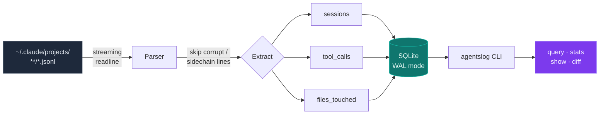
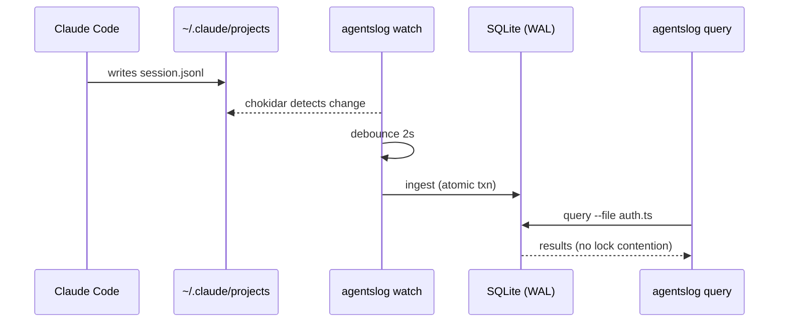
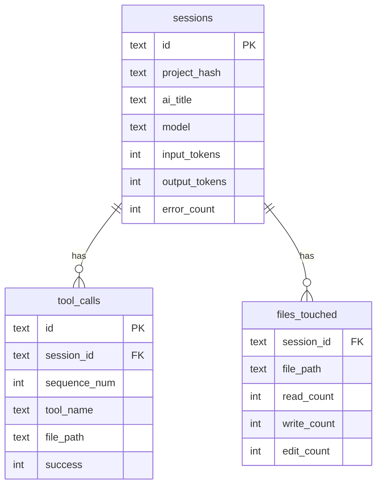

# 🕵️‍♂️ agentslog

[](https://www.npmjs.com/package/agentslog)
[](https://opensource.org/licenses/MIT)
[](https://nodejs.org/)

**Your Claude Code history is a database. Query it like one.**

Every Claude Code session writes a full JSONL transcript to `~/.claude/projects/`—every tool call, file edit, token count, and error. That data is already on your disk. You just couldn't ask it anything. Until now.

`agentslog` indexes all your local agent activity into a blazing-fast SQLite database and gives you a CLI to query across every session you've ever run.

**No cloud. No SDK. No account. It runs entirely on your machine and works on your existing history the moment you install it.**

<p align="center">
  
</p>

---

## 💡 Why do I need this?

If you use AI coding agents, you've likely experienced this:

* 🔍 **Rogue edits.** An agent touched a file it shouldn't have last week. *Which session was that, and what else did it change in the same run?*
* 💸 **Runaway token spend.** Your Anthropic bill spiked. *Which project, which model, which session is eating all the tokens?*
* 🧪 **Failed runs.** A task that worked yesterday broke today. *How did the two runs diverge—different tools, different files, more errors?*

The transcripts hold all the answers. `agentslog` makes them instantly queryable.

---

## 🚀 Quick Start

Requires Node.js ≥ 20.

```bash
# Install globally
npm install -g agentslog

# Index your existing history (fast & idempotent)
agentslog ingest

# Start querying!
agentslog stats
```

```
PERIOD      all time
SESSIONS    35
TOKENS      5.1M   (in: 160.1k  out: 4.9M  cached: 614M)
TOOLS       4,102  (errors: 186, 4.5%)

TOP FILES                         TOUCHES
page.tsx                          118
translations.ts                   49
CLAUDE.md                         34
PRs.md                            29

TOP TOOLS                         CALLS
Bash                              1,055
Read                              953
Edit                              857
Write                             279
```

---

## 🏗️ How it works

`agentslog` never touches the network. It reads the JSONL files Claude Code already writes, streams them through a parser, and builds a structured local index you can query in milliseconds.



A live `watch` daemon keeps the index fresh as new sessions land:



---

## 📖 Cookbook

Real problems, one command each.

### 🔍 Track down a rogue edit

> *"Something changed `auth.ts` and I don't know which run did it."*

```bash
agentslog query --file auth.ts
```

```
sessions touching auth.ts

SESSION ID    TITLE                           PROJECT             MODEL          STARTED    TOKENS
a1f3c8d2      Refactor auth middleware        my-api              opus-4-8        4h ago     88.1k
7be09c14      Add rate limiting               my-api              sonnet-4-6      2d ago     41.7k
```

Then open the offending run in full (see [Investigate a session](#-investigate-a-failed-run)).

### 💸 Find what's eating your token budget

> *"My API bill doubled this month. Where did it go?"*

```bash
agentslog stats --last 30d
agentslog sessions --last 30d        # sorted newest-first, with per-session token totals
agentslog sessions --project my-api  # narrow to one project
```

### 🧪 Investigate a failed run

> *"What exactly did this session do—every tool call, every file, every error?"*

```bash
agentslog show a1f3c8d2              # accepts any unique id prefix
```

```
Refactor auth middleware

Session         a1f3c8d2-0975-48c8-9b0c-1e10ca3c3a53
Project         ~/projects/my-api
Model           opus-4-8
Duration        1h 16m
User turns      9

Tokens
  Billed in     5,754
  Output        140,022
  Cache         read 9.6M, created 476.1k

Tool calls: 61 (10 errors)
  Bash            25
  Edit            15
  Agent           8
  …

Files touched: 3
  FILE                          R    W    E
  src/auth.ts                   1    1    10
  src/middleware.ts             2    0    5
  README.md                     1    0    0

Transcript: ~/.claude/projects/my-api/a1f3c8d2-…jsonl
```

### 🪞 Compare two runs of the same task

> *"Why did today's run fail when yesterday's worked?"*

```bash
agentslog diff a1f3c8d2 7be09c14
```

```
              A: a1f3c8d2               B: 7be09c14
title         Refactor auth middleware  Add rate limiting
model         opus-4-8                  sonnet-4-6
tokens        146.8k                    116.1k
tool calls    63                        40

Tool usage (A vs B)
  Bash            27    11    -16
  Edit            15    1     -14
  PowerShell      0     21    +21
```

### ⚙️ Audit a specific tool's usage

> *"Which sessions spawned sub-agents / ran shell commands / hit the web?"*

```bash
agentslog query --tool Agent         # sessions that spawned sub-agents
agentslog query --tool Bash          # sessions that ran shell commands
```

### 📡 Keep the index live

> *"Index new sessions automatically as I work."*

```bash
agentslog watch                      # run in the background; indexes on the fly
```

> **Time windows:** `--last` accepts `Ns`, `Nm`, `Nh`, `Nd`, `Nw` (seconds, minutes, hours, days, weeks).
> **Machine-readable:** add `--json` to `sessions`, `query`, and `stats` for piping into `jq` or scripts.

---

## 🔒 Architecture & Privacy

Everything stays on your machine. Here's what makes it trustworthy and fast:

* **Local-only, zero network.** `agentslog` makes no outbound calls—ever. It only reads files Claude Code already wrote.
* **Streaming parser.** Transcripts are read line-by-line via Node's `readline`, so multi-megabyte sessions index with constant memory. Partially-written or corrupt lines (from a crash or `Ctrl+C` mid-session) are skipped silently rather than halting the ingest.
* **Honest token accounting.** `input_tokens` is the sum of every assistant usage block—what you were actually billed. Because every request re-sends the full history, this is large by design, and it's the number that matters for cost.
* **Idempotent ingest.** Re-ingesting a session replaces its rows atomically in one transaction. Run `ingest` or `watch` as often as you like; nothing duplicates.
* **Safe under concurrency.** The database runs in **WAL mode** with a busy timeout, so the `watch` daemon and a manual query can hit it at the same time without locking each other out.
* **Stable project grouping.** Sessions are grouped by their `~/.claude/projects/` directory name (`project_hash`), which never changes even if you rename the folder. The displayed path is the most recent `cwd` seen for that group.

### Storage

The database lives in your OS application-data directory (resolved via [`env-paths`](https://www.npmjs.com/package/env-paths)), **never inside `~/.claude/`**—so a Claude Code update can't wipe it.

| OS | Location |
|----|----------|
| macOS | `~/Library/Application Support/agentslog/` |
| Linux | `~/.local/share/agentslog/` |
| Windows | `%LOCALAPPDATA%\agentslog\` |

### Data model



---

## 🛠️ Development

```bash
git clone https://github.com/MohammadYusif/agentslog.git
cd agentslog
npm install
npm run build
npm link           # installs the `agentslog` binary globally

npm run dev        # rebuild on change
npm test           # vitest suite
```

---

## ⚠️ Limitations (v0.1)

* **Sub-agent activity isn't rolled up yet.** Sub-agent (sidechain) transcripts share their parent's session id, so indexing them naively would overwrite the parent. For now they're skipped—stats reflect the main session thread. Attributing sub-agent work to the parent is the headline item for v0.2.
* **Claude Code only.** Aider / Cline / Continue support is on the roadmap once the Claude Code path is rock-solid.
* **No dollar costs.** Per-model pricing shifts too often to bake in reliably.
* **Terminal only.** Plain colored output—no web UI or TUI.

---

## License

[MIT](LICENSE) © MohammadYusif
